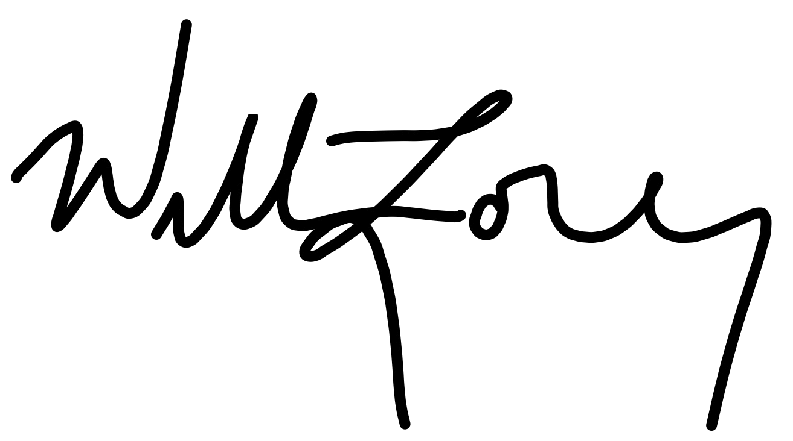

## About Will

This spring, I graduated college with a B.S. in Computer Engineering
and a minor in Computer Science - somehow with a **4.0 GPA**. 
College was the first time in my life that I **worked my ass off and
saw the results I was looking for**. While in school, I interned at 
**Boeing**,
**LMI Aerospace**, 
and **Garmin**, spent an 
unseemly amount of time
working with and leading my university's 
[solar car team](http://solarcar.mst.edu) as an 
Electrical/Software Team Member and 
as President, and took up the religion of technical interview prep (complete
with [bible](https://www.amazon.com/Cracking-Coding-Interview-Programming-Questions/dp/0984782850)).

Here's what a few of my managers had to say about me along the way:

> "Overall, Will exceeded my expectations for his 
> performance values as an intern. He is very professional, 
> innovative, and has great presentation skills." - Jessica Poor, Boeing

> "Will’s overall performance exceeded expectations for a software engineering 
> intern... Will spent a lot of his time outside of the internship 
> leading his solar car project for the university. 
> The fact that he was able to support both was a good demonstration of 
> his 'high throughput' capabilities." - Ted Mabie, Garmin

That's not to say my time wasn't spent without failures 
(yeah 2018 solar car race, I'm talking about you). But life's a mixed bag. All
you can do is learn from your experience and get better - at least that's what
I'm trying to do.

My work paid off when I landed my dream job as a 
Software Engineer at **Microsoft**. I'll be starting in their Seattle HQ
this fall and I couldn't be more grateful for the opportunity.

At this point in my life, I did the work, I got the degree, the job, and the 
[1.86 children](https://www.census.gov/topics/families/families-and-households.html) 
supporting salary, but I feel like I have yet to really explore my passions and 
find what drives me. The biggest life lesson I've learned to date is that
**I don't know what the hell to do with my life** and I've set
out to find some answers.

That's what this website is about: me trying things out - seeing what I like,
what I hate, what fuels me, and what makes me want to steer my life in different directions. 
So if you're into that, stick around because that's my journey and I hope watching
it unfold won't disappoint.

Thanks for reading.

  
  
June `19

