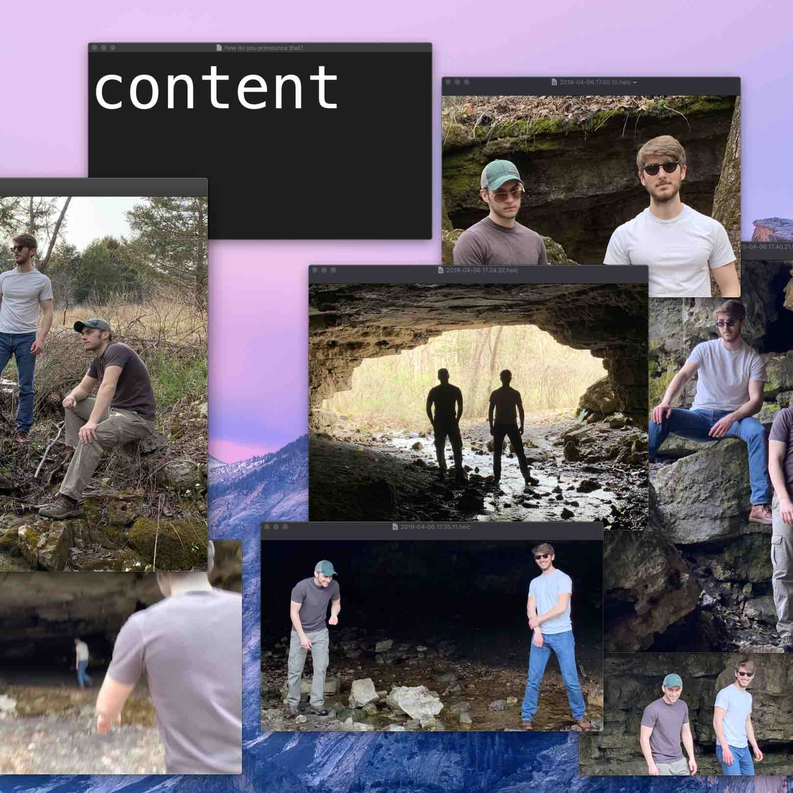
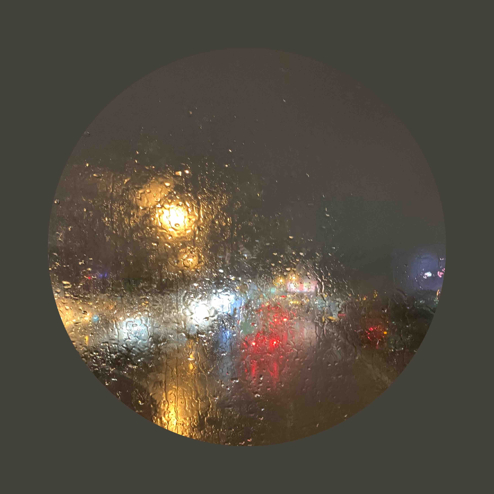
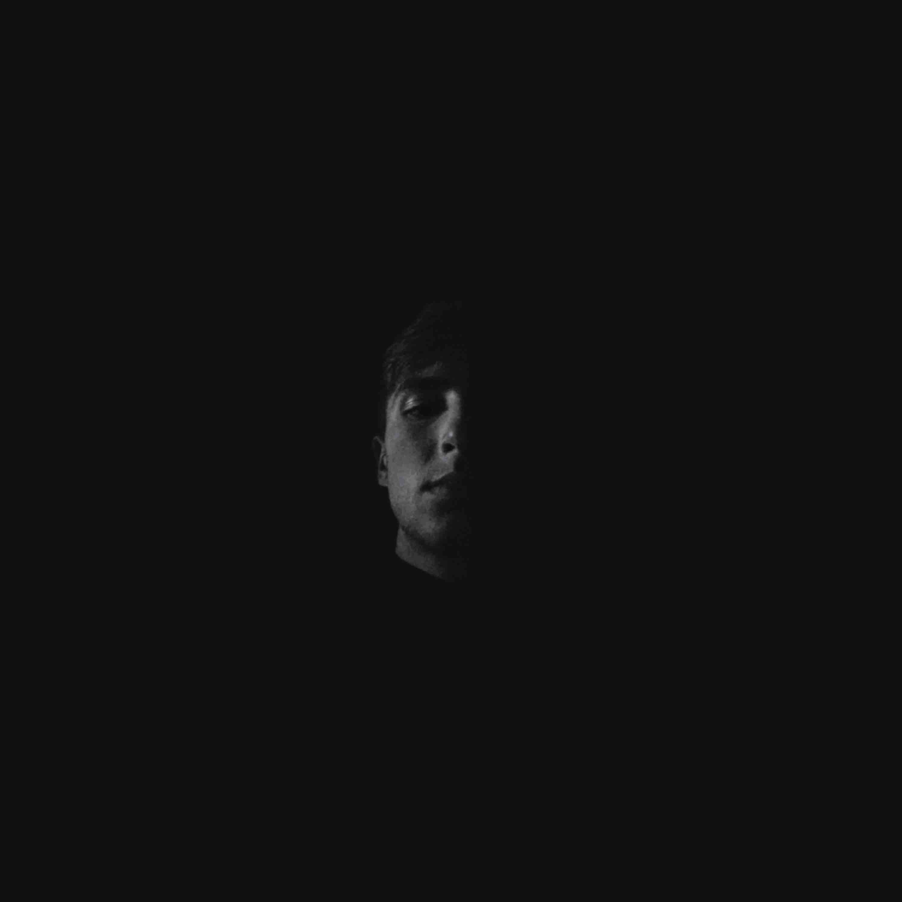

## Music

### content

The first EP from Schoonover & Lorey. Check out that Schoonover guy [here](https://www.instagram.com/jschoonie52/). 

Listen on [Spotify](https://open.spotify.com/album/7M4KYtLzfcnj0YekYrBQjh). Also available on 
[YouTube](https://www.youtube.com/channel/UCYs0VDPhVNyOfCRIhW1LbxQ) for free.

  

### Hidden Lanes

Will's second single. Betcha can't guess where that photo was taken.

Listen on [Spotify](https://open.spotify.com/album/6G9G52Ma7W5xwnHJZInmvn) or 
[YouTube](https://www.youtube.com/watch?v=C9k9KqlRrL4).

  

### Rear-view

Will's first single. Runner up for edgiest album cover of 2019.

Listen on [Spotify](https://open.spotify.com/album/5wtJFH5KB7YuUkBoefifIM) or 
[YouTube](https://www.youtube.com/watch?v=EW4PrSeS22I).

  

### Fun Facts

* All songs were recorded in Will's basement on an iPhone. #classy
* Josh & Will knew each other for 2.5 years before they started making music.
* "Lonely Soul" from *content* wrote itself.
